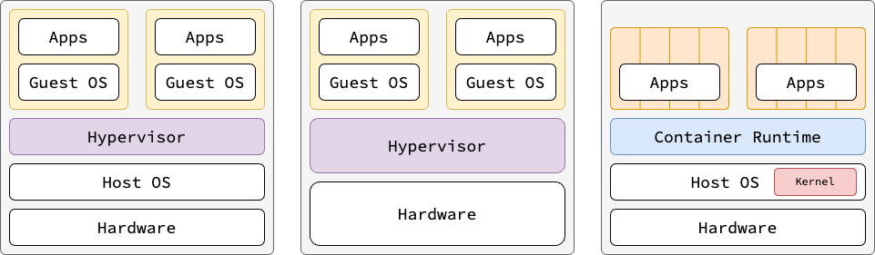
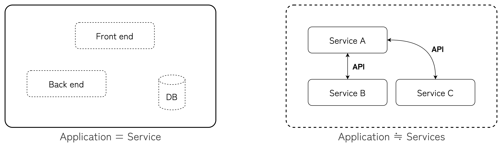

# つくって、壊して、直して学ぶ Kubernetes 入門

## 目次

- [つくって、壊して、直して学ぶ Kubernetes 入門](#つくって壊して直して学ぶ-kubernetes-入門)
  - [目次](#目次)
  - [Chapter 1.1 作ってみよう Kubernetes | Doker コンテナを作ってみる](#chapter-11-作ってみよう-kubernetes--doker-コンテナを作ってみる)
    - [コンテナ](#コンテナ)
    - [なぜコンテナを使うのか？](#なぜコンテナを使うのか)
      - [仮想マシン (VM) よりも高速にアプリケーションを起動できるようになった](#仮想マシン-vm-よりも高速にアプリケーションを起動できるようになった)
      - [マイクロサービスアーキテクチャとコンテナの相性が良い](#マイクロサービスアーキテクチャとコンテナの相性が良い)
    - [Docker](#docker)
      - [Docker のインストール (Ubuntu)](#docker-のインストール-ubuntu)
      - [Docker の基本コマンド](#docker-の基本コマンド)
    - [Docker image と Dockerfile](#docker-image-と-dockerfile)
      - [Docker image](#docker-image)
      - [Docker Hub](#docker-hub)
      - [Dockerfile](#dockerfile)
  - [Chapter 1.2 作ってみよう Kubernetes | Kubernetes クラスタを作ってみる](#chapter-12-作ってみよう-kubernetes--kubernetes-クラスタを作ってみる)
    - [Kubernetes](#kubernetes)
      - [Reconciliation Loop (調整ループ)](#reconciliation-loop-調整ループ)
      - [Infrastructure as Code (IaC)](#infrastructure-as-code-iac)
      - [Kubernetes API](#kubernetes-api)
      - [Minikube のインストール](#minikube-のインストール)
      - [Minikube クラスタに `echoserver` をデプロイする](#minikube-クラスタに-echoserver-をデプロイする)

## Chapter 1.1 作ってみよう Kubernetes | Doker コンテナを作ってみる

リポジトリ内の `./k8s-mbf/ch-01` ディレクトリへ移動していることを前提にコマンドなどの説明を行います。  

### コンテナ

コンテナは**アプリケーションとその実行環境をパッケージ化したもの**である。  
コンテナは名前空間 (namespace) や cgroup により通常のプロセスから隔離された仮想環境である。  
したがって、通常コンテナ内部のプロセスを外部から参照することはできない。  
ただし、`docker exec` コマンドや `nsenter` コマンドを用いると、ホストからコンテナのプロセス空間に対してアクセスすることが可能である。  

### なぜコンテナを使うのか？

Docker の登場以来、コンテナ仮想化技術を採用した開発・運用は盛んに行われている。  
ではなぜコンテナを選ぶケースが増えているのか。  
ここでは主に2つの理由について解説する。  

#### 仮想マシン (VM) よりも高速にアプリケーションを起動できるようになった

コンテナとよく比較される VM は、ハードウェアや OS を含めて仮想化する技術である。  
コンテナはそれ自体は OS を含まず、ホストの Kernel を共有する。  
それゆえ、リソースの消費が少なく起動時間も早いことからコンテナの採用率が増加していると考えられる。  



#### マイクロサービスアーキテクチャとコンテナの相性が良い

[マイクロサービスアーキテクチャ (Microservice Architecture)](https://knowledge.sakura.ad.jp/20167/) とは、一般に次のようなものを指す。  

1. 個々のマイクロサービスはそれぞれ独立したプロセスとして動作する
1. 各マイクロサービスは主にネットワーク経由で通信して所定のタスクを処理する
1. 各マイクロサービスはほかのマイクロサービスに依存せず起動でき、独立してデプロイやアップデートが可能

マイクロサービスの採用により、顧客に対して柔軟かつ高速にサービスの価値を提供できるようになる。  
したがって、マイクロサービスの性能を十分に発揮できるようなインフラとして、コンテナが採用される背景がある。  



### Docker

Docker はコンテナ仮想化技術の一つであり、**コンテナを作成・実行・管理するためのツール**である。  
Dockerfile, Docker image, Docker Hub とこれら一連の操作を提供する Docker CLI により、ユーザにとって一連のライフサイクルを扱いやすくしてくれている。  
Docker を使うことで、どの OS や環境でコンテナを実行しても必ず同じ動作をすることが保証される。

#### Docker のインストール (Ubuntu)

[Docker CE の入手](https://docs.docker.jp/engine/installation/linux/docker-ce/ubuntu.html)を参照。

#### Docker の基本コマンド

<details><summary>基本コマンド一覧を開く</summary><div>

- イメージを取得  
  (公式の nginx コンテナイメージをダウンロード)

  ```shell
  docker pull nginx
  ```

- コンテナを起動  
  (nginx をバックグラウンドで起動し、8080 でアクセス可能にする)

  ```shell
  docker run -d -p 8080:80 nginx
  ```

- 実行中のコンテナを確認

  ```shell
  docker ps
  ```

- コンテナを停止

  ```shell
  docker stop <コンテナID>
  ```

- コンテナを削除

  ```shell
  docker rm <コンテナID>
  ```

- イメージを削除

  ```shell
  docker rmi <イメージID>
  ```

</div></details>

### Docker image と Dockerfile

#### Docker image  

Docker でコンテナを作成するには、コンテナの元となるイメージ (image) を取得する必要がある。  
例えば、`nginx` のコンテナをデプロイする場面を考える。  
`nginx` のイメージは Nginx 公式が Docker Hub にイメージを公開しているものを使用することができる。  
このイメージの中には Nginx が動作するために必要な全てのファイルが含まれている。  

- 公式の Docker Hub に掲載している方法でイメージのダウンロードからコンテナのデプロイまでを行うことができる  

  ```shell
  docker run -d --name my-nginx -p 8080:80 nginx
  ```

- `http://localhost:8080` からアクセス可能なので、コンテナが起動しているか確認する  
- `neignx` コンテナの様子をログから確認する  

  ```shell
  docker logs --tail 1000 -f some-nginx
  ```

- コンテナの停止を行う  

  ```shell
  docker stop some-nginx
  ```

- 使い終わったコンテナは次のコマンドで削除する  
  ⚠️ ボリュームの永続化が行われていない場合、コンテナの終了とともに内部のデータはすべて削除されるので注意すること  

  ```shell
  docker rm some-nginx
  ```

- 現在のローカルにある Docker イメージを確認する  

  ```shell
  docker images
  ```

- 不要な場合は適宜イメージも削除する  

  ```shell
  docker rmi nginx:latest
  ```

#### Docker Hub

[Docker Hub](https://hub.docker.com/) は Docker の公式リポジトリで、様々なイメージを提供している。  
Docker Hub にあるイメージを取得するには、以下のように `docker pull` を実行する。  

- Ubuntu 24.04 LTS のイメージを取得する  

  ```shell
  docker pull ubuntu
  ```
  
- 取得したイメージからコンテナを作成する  

  ```shell
  docker run -it ubuntu bash
  ```

  - `docker run` 実行時、ローカルにイメージが存在しない場合は自動で Docker Hub からイメージをダウンロードする  

#### Dockerfile

Dockerfile はオリジナルの Docker イメージを作成するためのレシピである。  
例えば、自分で作成したアプリをコンテナでデプロイすることを考える。  
その場合はほぼ確実に自前で Dockerfile を書き、アプリ用の Docker イメージを作成する必要がある。  
試しに、[`./ch-01/myapp` ディレクトリ](./ch-01)にある Dockerfile と Go 言語で書かれたサンプルアプリを使って自作アプリ用のイメージを作成する。  

- `ls ./ch-01/myapp` コマンドで以下のファイルが存在することを確認する  

  ```shell
  Dockerfile  README.md  docker-compose.yaml  testapp.go
  ```

- `testapp.go` と `Dockerfile` の中を確認する  

  <details><summary>testapp.go</summary><div>

  ```go
  package main
  
  import (
    "fmt"
    "net/http"
  )

  func handler(w http.ResponseWriter, r *http.Request) {
    fmt.Fprintln(w, "Hello, Docker with Go!")
  }

  func main() {
    http.HandleFunc("/", handler)
    fmt.Println("Server is running on port 8080...")
    http.ListenAndServe(":8080", nil)
  }
  ```

  </div></details>

  <details><summary>Dockerfile</summary><div>

  ```Dockerfile
  # 最新のGoの公式イメージをベースにする
  FROM golang:latest

  # 環境変数を設定
  # OSをLinuxに設定
  ENV GOOS=linux
  # アーキテクチャをamd64に設定
  ENV GOARCH=amd64

  # 作業ディレクトリを作成
  WORKDIR /app

  # 必要なファイルをコピー
  COPY testapp.go .

  # Goのビルド（バイナリを作成）
  RUN go build -o app testapp.go && chmod +x app

  # コンテナのポートを開放
  EXPOSE 8080

  # 実行するコマンド
  CMD ["./app"]
  ```

  </div></details>

- `docker build` を実行してイメージを作成する  

  ```shell
  docker build ./myapp/ --tag testapp:1.0.0
  ```

- `docker images` を実行して自作イメージが作成されたことを確認する  

  ```shell
  REPOSITORY       TAG       IMAGE ID       CREATED        SIZE
  testapp          1.0.0     ec0cb3683811   20 hours ago   938MB
  ```

- 自作イメージを使ってコンテナをデプロイする  

  ```shell
  docker run -d --name my-go-app -p 8080:8080 testapp:1.0.0
  ```

- 疎通確認を行う  

  ```shell
  curl http://localhost:8080
  ```

  - 出力結果
  
    ```shell
    Hello, Docker with Go!
    ```

## Chapter 1.2 作ってみよう Kubernetes | Kubernetes クラスタを作ってみる

### Kubernetes

> Kubernetes is an open source container orchestration engine for automating deployment, scaling, and management of containerized applications. The open source project is hosted by the Cloud Native Computing Foundation (CNCF).

Docker の登場により、エンジニアはコンテナを使ったアプリケーションの開発を行うようになった。  
その結果、大量のコンテナを運用・保守・管理することになる。  
たとえば、**複数台のサーバでコンテナをデプロイ**するような場合、次のような問題が発生する。  

- 障害時、コンテナごとに設定を行い復旧する必要がある
- 様々なコンテナの仕様を個々に管理するのは大変
- どのノードでコンテナをデプロイすべきか判断しなければならない

これらの問題を解決する手段のひとつが [Kubernetes](https://kubernetes.io/) である。  
Kubernetes はコンテナオーケストレーションエンジンとして以下の強力な機能を兼ね備えている。  

#### Reconciliation Loop (調整ループ)

Kubernetes は宣言型のインフラツールである。  
予め**システムの望ましい状態 (Desired State)** を定義することで、Kubernetes は宣言通りの状態を保とうとする。  
**Desired State を達成するよう自動で動作する**仕組みを Reconciliation Loop と呼ぶ。  
一方で、Ansible などの手続き型のインフラツールでは、やるべきことを順番通りに記述して実行するシンプルな構成が特徴である。  
しかし、障害時のエラーハンドリングも考慮して記述する必要があるため、予めエラーを予測して定義する必要がある。  

#### Infrastructure as Code (IaC)

[Infrastructure as Code (IaC)](https://aws.amazon.com/what-is/iac/?nc1=h_ls) はソースコードでインフラの記述し、管理及びプロビジョニングを行うことである。  
Kubernetes では YAML ファイルを利用してクラスタの管理からアプリケーションの管理までを行うことができる。  
特に、YAML ファイルのことをよくマニフェストファイルと呼ぶ。  
IaC の特徴は、コード化によるインフラの Git 管理が可能になった点が挙げられる。  
これにより、リポジトリの差分を参照したり、GitOps の考え方である **default リポジトリに保存されたマニフェストが常に最新である**という管理方法を実践できる。  

#### Kubernetes API

Kubernetes にはコンテナオーケストレーションを実現するための様々な API が定義されている。  
マニフェストに書かれた情報は、常に Kubernetes では一意の宣言になる。  
したがって、ベアメタルなどのインフラレイヤの抽象化が行われ、アプリケーションを管理している間、インフラレイヤに関係する固有の情報を機にする必要がなくなる。  
これを**所掌の分離**という。  

---

**ベアメタル**  

物理サーバー上に Kubernetes クラスタを直接構築する方法。  
OS やネットワーク、ストレージの管理を自分で行う必要がある。  
高パフォーマンスかつクラウドプロバイダなどのベンダーロックインなしで Kubernetes クラスタを運用可能である。  
しかし、その分運用コストが高く、また Kubespray などをはじめとする Kubernetes プロビジョニングツールがあるものの、依然として初期構築の大変さは変わらない。  

**クラウドサービスプロバイダ （GKE, EKS, AKS, etc....）**  

Google Cloud、AWS、Azure などのマネージド Kubernetes サービスを利用する方法である。  
ノードの管理をクラウドプロバイダに任せられるのが最大の特徴であり、コントロールプレーンなどの管理を行う必要がない。  
しかし、ベンダー依存性が高いサービスや、ランニングコストの高さから、個人利用では中々選択肢として選び難いという事情がある。  

**kind**  

kind は Kubernets をローカル環境で手軽にシミュレーションできる便利なツールのひとつである。  
Docker 上で完結して動作することが可能であり、軽量な環境構築が可能である。  

**Minikube**  

Minikube は Kubernetes をローカル環境で手軽にシミュレーションできる便利なツールのひとつである。  
Docker に限らず、 VirtualBoxやHyper-Vなどで動作することができ、ドライバの選択肢が広いのが特徴である。

---

| 環境 | メリット | デメリット | 用途 |
|---|---|---|---|
| **ベアメタル** | 高パフォーマンス、自由度が高い | 運用負担が大きい、スケールが難しい | **オンプレ本番環境** |
| **クラウドプロバイダ** | 運用負担が少ない、自動スケール可能 | コスト高、ベンダーロックイン | **クラウド本番環境** |
| **kind** | 軽量、CI/CD 向き | 実運用には向かない | **開発・テスト環境** |
| **minikube** | シンプル、ローカルで動作 | シングルノード、パフォーマンス低い | **学習・開発環境** |

#### Minikube のインストール

今回の学習では Minikube を用いる。  
Minikube の詳細なインストール方法については[公式サイト](https://minikube.sigs.k8s.io/docs/start/?arch=%2Flinux%2Fx86-64%2Fstable%2Fbinary+download)を参照されたい。  

- LinuxOS (x86) 環境では、以下のコマンドを使ってバイナリをダウンロードする  

  ```shell
  curl -LO https://github.com/kubernetes/minikube/releases/latest/download/minikube-linux-amd64
  ```

- Minikube のインストールを実行する  

  ```shell
  sudo install minikube-linux-amd64 /usr/local/bin/minikube
  ```

- インストールが完了したらバイナリデータを削除する  

  ```shell
  rm minikube-linux-amd64
  ```

- Minikube を起動する  

  ```shell
  minikube start
  ```

- `kubectl` コマンドのエイリアスを設定して実行しやすくする  

  ```shell
  alias kubectl="minikube kubectl --"
  ```

- 現在獲得できるクラスタのコンテキストを表示する  

  ```shell
  kubectl config get-contexts
  ```

  - 出力結果  

    ```shell
    CURRENT   NAME       CLUSTER    AUTHINFO   NAMESPACE
    *         minikube   minikube   minikube   default
    ```

- コンテキストを `minikube` に設定する  

  ```shell
  kubectl config use-context minikube
  ```

- 現在設定されているコンテキストを確認する  

  ```shell
  kubectl config current-context
  ```

  - 出力結果  

    ```shell
    minikube
    ```

#### Minikube クラスタに `echoserver` をデプロイする

- Minikube クラスタにサンプル用のアプリ `echoserver` をデプロイする  
  Deployment は `hello-minikube` で作成します  

  ```shell
  kubectl create deployment hello-minikube --image=registry.k8s.io/echoserver:1.10
  ```

- Service を作成し 8080 番ポートで `hello-minikube` を公開する  

  ```shell
  kubectl expose deployment hello-minikube --type=NodePort --port=8080
  ```

- Pod が稼働していることを確認する  

  ```shell
  kubectl get pods
  ```

  - 出力結果 | STATUS が `Running` であれば準備 OK  
  
    ```shell
    NAME                              READY   STATUS    RESTARTS   AGE
    hello-minikube-8696bfd944-t7b98   1/1     Running   0          43s
    ```

- 公開した Service の URL を変数 `$URL` へ保存する  

  ```shell
  export URL=$(minikube service hello-minikube --url)
  ```

- `curl` コマンドを用いて Service 情報を取得する  

  ```shell
  curl $URL -p 8080
  ```

  - 出力結果  

    ```shell
    Hostname: hello-minikube-8696bfd944-t7b98

    Pod Information:
            -no pod information available-

    Server values:
            server_version=nginx: 1.13.3 - lua: 10008

    Request Information:
            client_address=10.244.0.1
            method=GET
            real path=/
            query=
            request_version=1.1
            request_scheme=http
            request_uri=http://192.168.49.2:8080/

    Request Headers:
            accept=*/*
            host=192.168.49.2:32496
            user-agent=curl/7.81.0

    Request Body:
            -no body in request-
    ```

- 使い終わった Service を削除する  

  ```shell
  kubectl delete services hello-minikube
  ```

- 同様に Deployment の削除  

  ```shell
  kubectl delete deployment hello-minikube
  ```

- Minikube の停止は次のコマンドで可能  

  ```shell
  minikube stop
  ```

  - 出力結果

    ```shell
    ✋  Stopping node "minikube"  ...
    🛑  Powering off "minikube" via SSH ...
    🛑  1 node stopped.
    ```

- Minikube クラスタの削除は以下のコマンドで可能  

  ```shell
  minikube delete
  ```

  - 出力結果

    ```shell
    🔥  Deleting "minikube" in docker ...
    🔥  Deleting container "minikube" ...
    🔥  Removing /home/cyokozai/.minikube/machines/minikube ...
    💀  Removed all traces of the "minikube" cluster.
    ```
  
  - Docker からも削除されたことを確認する  

    ```shell
    $ docker ps
    CONTAINER ID   IMAGE     COMMAND   CREATED   STATUS    PORTS     NAMES
    ```

