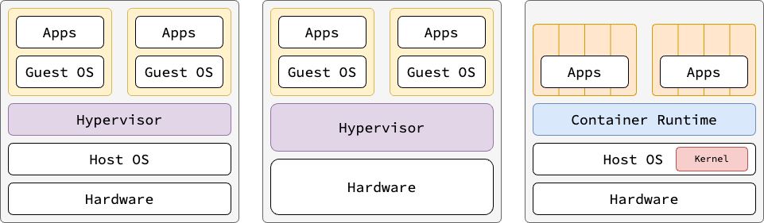
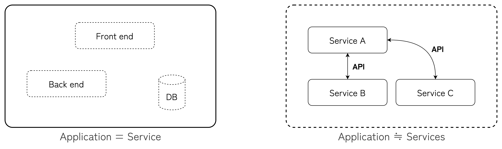
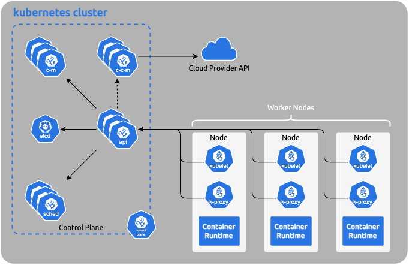
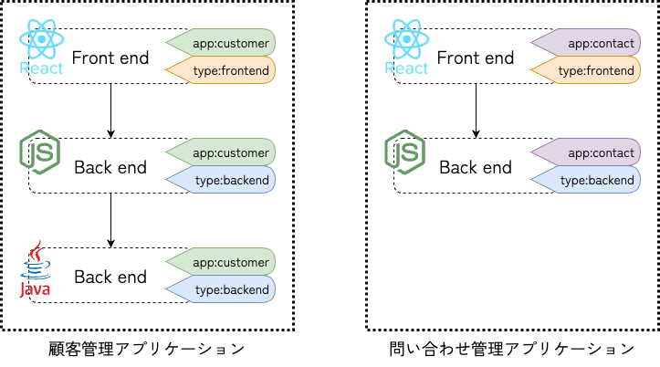
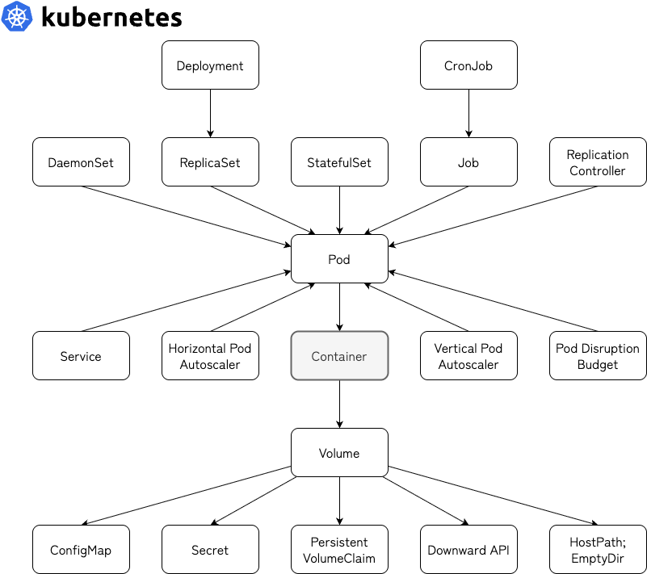
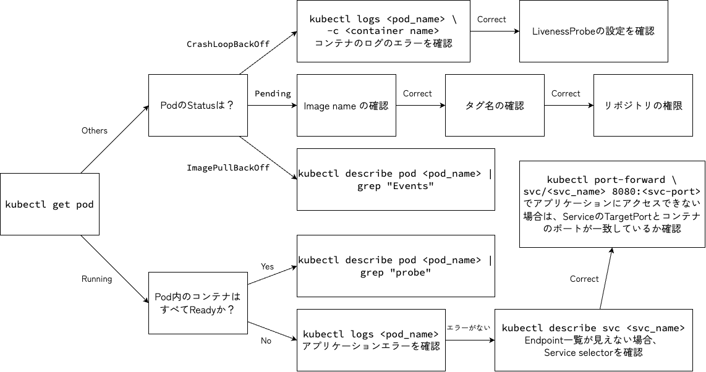

# つくって、壊して、直して学ぶ Kubernetes 入門

## 目次

- [つくって、壊して、直して学ぶ Kubernetes 入門](#つくって壊して直して学ぶ-kubernetes-入門)
  - [目次](#目次)
  - [Chapter 1.1 作ってみよう Kubernetes | Doker コンテナを作ってみる](#chapter-11-作ってみよう-kubernetes--doker-コンテナを作ってみる)
    - [コンテナ](#コンテナ)
    - [なぜコンテナを使うのか？](#なぜコンテナを使うのか)
    - [Docker](#docker)
  - [Chapter 1.2 作ってみよう Kubernetes | Kubernetes クラスタを作ってみる](#chapter-12-作ってみよう-kubernetes--kubernetes-クラスタを作ってみる)
    - [Kubernetes](#kubernetes)
  - [Chapter 1.3 作ってみよう Kubernetes | 全体像の説明](#chapter-13-作ってみよう-kubernetes--全体像の説明)
  - [Chapter 1.4 作ってみよう Kubernetes | アプリケーションを Kubernetes クラスタ上に作る](#chapter-14-作ってみよう-kubernetes--アプリケーションを-kubernetes-クラスタ上に作る)
    - [マニフェストについて](#マニフェストについて)
    - [Kubernetes のリソース](#kubernetes-のリソース)
    - [Pod を動作させる](#pod-を動作させる)
  - [トラブルシューティングガイドと `kubectl` コマンドの使い方](#トラブルシューティングガイドと-kubectl-コマンドの使い方)
    - [Trouble shooting](#trouble-shooting)
    - [STATUS カラム](#status-カラム)
    - [`kubectl get`: Kubernetes リソースの取得](#kubectl-get-kubernetes-リソースの取得)

## Chapter 1.1 作ってみよう Kubernetes | Doker コンテナを作ってみる

リポジトリ内の `./k8s-mbf/ch-01` ディレクトリへ移動していることを前提にコマンドなどの説明を行います。  

### コンテナ

コンテナは**アプリケーションとその実行環境をパッケージ化したもの**である。  
コンテナは名前空間 (namespace) や cgroup により通常のプロセスから隔離された仮想環境である。  
したがって、通常コンテナ内部のプロセスを外部から参照することはできない。  
ただし、`docker exec` コマンドや `nsenter` コマンドを用いると、ホストからコンテナのプロセス空間に対してアクセスすることが可能である。  

### なぜコンテナを使うのか？

Docker の登場以来、コンテナ仮想化技術を採用した開発・運用は盛んに行われている。  
ではなぜコンテナを選ぶケースが増えているのか。  
ここでは主に2つの理由について解説する。  

**仮想マシン (VM) よりも高速にアプリケーションを起動できるようになった**

コンテナとよく比較される VM は、ハードウェアや OS を含めて仮想化する技術である。  
コンテナはそれ自体は OS を含まず、ホストの Kernel を共有する。  
それゆえ、リソースの消費が少なく起動時間も早いことからコンテナの採用率が増加していると考えられる[^1]。  

[^1]: <https://kubernetes.io/ja/docs/concepts/overview/>



**マイクロサービスアーキテクチャとコンテナの相性が良い**

[マイクロサービスアーキテクチャ (Microservice Architecture)](https://knowledge.sakura.ad.jp/20167/) とは、一般に次のようなものを指す。  

1. 個々のマイクロサービスはそれぞれ独立したプロセスとして動作する
2. 各マイクロサービスは主にネットワーク経由で通信して所定のタスクを処理する
3. 各マイクロサービスはほかのマイクロサービスに依存せず起動でき、独立してデプロイやアップデートが可能

マイクロサービスの採用により、顧客に対して柔軟かつ高速にサービスの価値を提供できるようになる。  
したがって、マイクロサービスの性能を十分に発揮できるようなインフラとして、コンテナが採用される背景がある。  



### Docker

Docker はコンテナ仮想化技術の1つであり、**コンテナを作成・実行・管理するためのツール**である。  
Dockerfile, Docker image, Docker Hub とこれら一連の操作を提供する Docker CLI により、ユーザにとって一連のライフサイクルを扱いやすくしてくれている。  
Docker を使うことで、どの OS や環境でコンテナを実行しても必ず同じ動作をすることが保証される。

**Docker のインストール (Ubuntu)**

[Docker CE の入手](https://docs.docker.jp/engine/installation/linux/docker-ce/ubuntu.html)を参照。

**Docker の基本コマンド**

<details><summary>基本コマンド一覧を開く</summary><div>

- イメージを取得  
  (公式の nginx コンテナイメージをダウンロード)

  ```shell
  docker pull nginx
  ```

- コンテナを起動  
  (nginx をバックグラウンドで起動し、8080 でアクセス可能にする)

  ```shell
  docker run -d -p 8080:80 nginx
  ```

- 実行中のコンテナを確認

  ```shell
  docker ps
  ```

- コンテナを停止

  ```shell
  docker stop <コンテナID>
  ```

- コンテナを削除

  ```shell
  docker rm <コンテナID>
  ```

- イメージを削除

  ```shell
  docker rmi <イメージID>
  ```

</div></details>

**Docker image と Dockerfile**

***Docker image***  

Docker でコンテナを作成するには、コンテナの元となるイメージ (image) を取得する必要がある。  
例えば、`nginx` のコンテナをデプロイする場面を考える。  
`nginx` のイメージは Nginx 公式が Docker Hub にイメージを公開しているものを使用することができる。  
このイメージの中には Nginx が動作するために必要なすべてのファイルが含まれている。  

- 公式の Docker Hub に掲載している方法でイメージのダウンロードからコンテナのデプロイまでを行うことができる  

  ```shell
  docker run -d --name my-nginx -p 8080:80 nginx
  ```

- `http://localhost:8080` からアクセス可能なので、コンテナが起動しているか確認する  
- `neignx` コンテナの様子をログから確認する  

  ```shell
  docker logs --tail 1000 -f some-nginx
  ```

- コンテナの停止を行う  

  ```shell
  docker stop some-nginx
  ```

- 使い終わったコンテナは次のコマンドで削除する  
  ⚠️ ボリュームの永続化が行われていない場合、コンテナの終了とともに内部のデータはすべて削除されるので注意すること  

  ```shell
  docker rm some-nginx
  ```

- 現在のローカルにある Docker イメージを確認する  

  ```shell
  docker images
  ```

- 不要な場合は適宜イメージも削除する  

  ```shell
  docker rmi nginx:latest
  ```

***Docker Hub***  

[Docker Hub](https://hub.docker.com/) は Docker の公式リポジトリで、様々なイメージを提供している。  
Docker Hub にあるイメージを取得するには、以下のように `docker pull` を実行する。  

- Ubuntu 24.04 LTS のイメージを取得する  

  ```shell
  docker pull ubuntu
  ```
  
- 取得したイメージからコンテナを作成する  

  ```shell
  docker run -it ubuntu bash
  ```

  - `docker run` 実行時、ローカルにイメージが存在しない場合は自動で Docker Hub からイメージをダウンロードする  

***Dockerfile***  

Dockerfile はオリジナルの Docker イメージを作成するためのレシピである。  
例えば、自分で作成したアプリをコンテナでデプロイすることを考える。  
その場合はほぼ確実に自前で Dockerfile を書き、アプリ用の Docker イメージを作成する必要がある。  
試しに、[`./ch-01/myapp` ディレクトリ](./ch-01)にある Dockerfile と Go 言語で書かれたサンプルアプリを使って自作アプリ用のイメージを作成する。  

- `ls ./ch-01/myapp` コマンドで以下のファイルが存在することを確認する  

  ```shell
  Dockerfile  README.md  docker-compose.yaml  testapp.go
  ```

- `testapp.go` と `Dockerfile` の中を確認する  

  <details><summary>testapp.go</summary><div>

  ```go
  package main
  
  import (
    "fmt"
    "net/http"
  )

  func handler(w http.ResponseWriter, r *http.Request) {
    fmt.Fprintln(w, "Hello, Docker with Go!")
  }

  func main() {
    http.HandleFunc("/", handler)
    fmt.Println("Server is running on port 8080...")
    http.ListenAndServe(":8080", nil)
  }
  ```

  </div></details>

  <details><summary>Dockerfile</summary><div>

  ```Dockerfile
  # 最新のGoの公式イメージをベースにする
  FROM golang:latest

  # 環境変数を設定
  # OSをLinuxに設定
  ENV GOOS=linux
  # アーキテクチャをamd64に設定
  ENV GOARCH=amd64

  # 作業ディレクトリを作成
  WORKDIR /app

  # 必要なファイルをコピー
  COPY testapp.go .

  # Goのビルド（バイナリを作成）
  RUN go build -o app testapp.go && chmod +x app

  # コンテナのポートを開放
  EXPOSE 8080

  # 実行するコマンド
  CMD ["./app"]
  ```

  </div></details>

- `docker build` を実行してイメージを作成する  

  ```shell
  docker build ./myapp/ --tag testapp:1.0.0
  ```

- `docker images` を実行して自作イメージが作成されたことを確認する  

  ```shell
  REPOSITORY       TAG       IMAGE ID       CREATED        SIZE
  testapp          1.0.0     ec0cb3683811   20 hours ago   938MB
  ```

- 自作イメージを使ってコンテナをデプロイする  

  ```shell
  docker run -d --name my-go-app -p 8080:8080 testapp:1.0.0
  ```

- 疎通確認を行う  

  ```shell
  curl http://localhost:8080
  ```

  - 出力結果
  
    ```shell
    Hello, Docker with Go!
    ```

## Chapter 1.2 作ってみよう Kubernetes | Kubernetes クラスタを作ってみる

### Kubernetes

> Kubernetes is an open source container orchestration engine for automating deployment, scaling, and management of containerized applications. The open source project is hosted by the Cloud Native Computing Foundation (CNCF).

Docker の登場により、エンジニアはコンテナを使ったアプリケーションの開発を行うようになった。  
その結果、大量のコンテナを運用・保守・管理することになる。  
たとえば、**複数台のサーバでコンテナをデプロイ**するような場合、次のような問題が発生する。  

- 障害時、コンテナごとに設定を行い復旧する必要がある
- 様々なコンテナの仕様を個々に管理するのは大変
- どのノードでコンテナをデプロイすべきか判断しなければならない

これらの問題を解決する手段のひとつが [Kubernetes](https://kubernetes.io/) である。  
Kubernetes はコンテナオーケストレーションエンジンとして以下の強力な機能を兼ね備えている[^2]。  

**Reconciliation Loop (調整ループ)**  

Kubernetes は宣言型のインフラツールである。  
予め**システムの望ましい状態 (Desired State)** を定義することで、Kubernetes は宣言通りの状態を保とうとする。  
**Desired State を達成するよう自動で動作する**仕組みを Reconciliation Loop と呼ぶ。  
一方で、Ansible などの手続き型のインフラツールでは、やるべきことを順番通りに記述して実行するシンプルな構成が特徴である。  
しかし、障害時のエラーハンドリングも考慮して記述する必要があるため、予めエラーを予測して定義する必要がある。  

**Infrastructure as Code (IaC)**  

[Infrastructure as Code (IaC)](https://aws.amazon.com/what-is/iac/?nc1=h_ls) はソースコードでインフラの記述し、管理及びプロビジョニングを行うことである。  
Kubernetes では YAML ファイルを利用してクラスタの管理からアプリケーションの管理までを行うことができる。  
特に、YAML ファイルのことをよくマニフェストファイルと呼ぶ。  
IaC の特徴は、コード化によるインフラの Git 管理が可能になった点が挙げられる。  
これにより、リポジトリの差分を参照したり、GitOps の考え方である **default リポジトリに保存されたマニフェストが常に最新である**という管理方法を実践できる。  

**Kubernetes API**  

Kubernetes にはコンテナオーケストレーションを実現するための様々な API が定義されている。  
マニフェストに書かれた情報は、常に Kubernetes では一意の宣言になる。  
したがって、ベアメタルなどのインフラレイヤの抽象化が行われ、アプリケーションを管理している間、インフラレイヤに関係する固有の情報を機にする必要がなくなる。  
これを**所掌の分離**という。  

[^2]: <https://kubernetes.io/ja/docs/concepts/overview/#why-you-need-kubernetes-and-what-can-it-do>

**Kubernetes アーキテクチャ**  

Kubernetes のアーキテクチャについて簡単に説明する[^3]。  
Kubernetesクラスタは、 コンテナ化されたアプリケーションを実行する、ノードと呼ばれるワーカーマシンの集合である。  
すべてのクラスタには少なくとも1つのワーカーノードが存在する。  



***ワーカーノード***  

ワーカーノードはPodをホストする役割を担う。  
Podとは、Kubernetes内で作成・管理できるコンピューティングの最小のデプロイ可能なユニットであり、アプリケーションのコンポーネントの要素でもある。  
ワーカーノードは、アプリケーションワークロードのコンポーネントであるPodをホストし、コンテナを実行する。  

- kubelet  
- k-proxy  
- container runtime  

***コントロールプレーン***  

コントロールプレーンコンポーネントは、クラスタに関する全体的な決定(スケジューリングなど)を行う。  
また、クラスタイベントの検出および応答を処理する (たとえば、deploymentのreplicasフィールドが満たされていない場合に、新しい Pod を起動する等)。  

[^3]: <https://kubernetes.io/ja/docs/concepts/overview/components/>

**Kubernetes のインストール**  

ここからは Kubernetes を実際に触っていく。  
その前に、代表的な Kubernetes 環境についてそれぞれ比較する。  

***ベアメタル***  

物理サーバー上に Kubernetes クラスタを直接構築する方法。  
OS やネットワーク、ストレージの管理を自分で行う必要がある。  
高パフォーマンスかつクラウドプロバイダなどのベンダーロックインなしで Kubernetes クラスタを運用可能である。  
しかし、その分運用コストが高く、また Kubespray などをはじめとする Kubernetes プロビジョニングツールがあるものの、依然として初期構築の大変さは変わらない。  

***クラウドサービスプロバイダ （GKE, EKS, AKS, etc....）***  

Google Cloud、AWS、Azure などのマネージド Kubernetes サービスを利用する方法である。  
ノードの管理をクラウドプロバイダに任せられるのが最大の特徴であり、コントロールプレーンなどの管理を行う必要がない。  
しかし、ベンダー依存性が高いサービスや、ランニングコストの高さから、個人利用では中々選択肢として選び難いという事情がある。  

***kind***  

kind は Kubernetes をローカル環境で手軽にシミュレーションできる便利なツールのひとつである。  
Docker 上で完結して動作することが可能であり、軽量な環境構築が可能である。  

***Minikube***  

Minikube は Kubernetes をローカル環境で手軽にシミュレーションできる便利なツールのひとつである。  
Docker に限らず、 VirtualBoxやHyper-Vなどで動作することができ、ドライバの選択肢が広いのが特徴である。

| 環境 | メリット | デメリット | 用途 |
|---|---|---|---|
| **ベアメタル** | 高パフォーマンス、自由度が高い | 運用負担が大きい、スケールが難しい | **オンプレ本番環境** |
| **クラウドプロバイダ** | 運用負担が少ない、自動スケール可能 | コスト高、ベンダーロックイン | **クラウド本番環境** |
| **kind** | 軽量、CI/CD 向き | 実運用には向かない | **開発・テスト環境** |
| **minikube** | シンプル、ローカルで動作 | シングルノード、パフォーマンス低い | **学習・開発環境** |

---

今回の学習では Minikube を用いる。  
インストールの手順について解説する。  
Minikube の詳細なインストール方法については[公式サイト](https://minikube.sigs.k8s.io/docs/start/?arch=%2Flinux%2Fx86-64%2Fstable%2Fbinary+download)を参照されたい。  

- LinuxOS (x86) 環境では、以下のコマンドを使ってバイナリをダウンロードする  

  ```shell
  curl -LO https://github.com/kubernetes/minikube/releases/latest/download/minikube-linux-amd64
  ```

- Minikube のインストールを実行する  

  ```shell
  sudo install minikube-linux-amd64 /usr/local/bin/minikube
  ```

- インストールが完了したらバイナリデータを削除する  

  ```shell
  rm minikube-linux-amd64
  ```

- Minikube を起動する  

  ```shell
  minikube start
  ```

- `kubectl` コマンドのエイリアスを設定して実行しやすくする  

  ```shell
  alias kubectl="minikube kubectl --"
  ```

- 現在獲得できるクラスタのコンテキストを表示する  

  ```shell
  kubectl config get-contexts
  ```

  - 出力結果  

    ```shell
    CURRENT   NAME       CLUSTER    AUTHINFO   NAMESPACE
    *         minikube   minikube   minikube   default
    ```

- コンテキストを `minikube` に設定する  

  ```shell
  kubectl config use-context minikube
  ```

- 現在設定されているコンテキストを確認する  

  ```shell
  kubectl config current-context
  ```

  - 出力結果  

    ```shell
    minikube
    ```
  
  - `~/.kube/config` ファイルを確認する  

    ```yaml
    apiVersion: v1
    clusters:
    - cluster:
        certificate-authority: /home/cyokozai/.minikube/ca.crt
        extensions:
        - extension:
            last-update: Wed, 12 Mar 2025 20:55:34 UTC
            provider: minikube.sigs.k8s.io
            version: v1.35.0
          name: cluster_info
        server: https://192.168.49.2:8443
      name: minikube
    contexts:
    - context:
        cluster: minikube
        extensions:
        - extension:
            last-update: Wed, 12 Mar 2025 20:55:34 UTC
            provider: minikube.sigs.k8s.io
            version: v1.35.0
          name: context_info
        namespace: default
        user: minikube
      name: minikube
    current-context: minikube
    kind: Config
    preferences: {}
    users:
    - name: minikube
      user:
        client-certificate: /home/cyokozai/.minikube/profiles/minikube/client.crt
        client-key: /home/cyokozai/.minikube/profiles/minikube/client.key
    ```

**Minikube クラスタに `echoserver` をデプロイする**  

- Minikube クラスタにサンプル用のアプリ `echoserver` をデプロイする  
  Deployment は `hello-minikube` で作成します  

  ```shell
  kubectl create deployment hello-minikube --image=registry.k8s.io/echoserver:1.10
  ```

- Service を作成し 8080 番ポートで `hello-minikube` を公開する  

  ```shell
  kubectl expose deployment hello-minikube --type=NodePort --port=8080
  ```

- Pod が稼働していることを確認する  

  ```shell
  kubectl get pods
  ```

  - 出力結果 | STATUS が `Running` であれば準備 OK  
  
    ```shell
    NAME                              READY   STATUS    RESTARTS   AGE
    hello-minikube-8696bfd944-t7b98   1/1     Running   0          43s
    ```

- 公開した Service の URL を変数 `$URL` へ保存する  

  ```shell
  export URL=$(minikube service hello-minikube --url)
  ```

- `curl` コマンドを用いて Service 情報を取得する  

  ```shell
  curl $URL -p 8080
  ```

  - 出力結果  

    ```shell
    Hostname: hello-minikube-8696bfd944-t7b98

    Pod Information:
            -no pod information available-

    Server values:
            server_version=nginx: 1.13.3 - lua: 10008

    Request Information:
            client_address=10.244.0.1
            method=GET
            real path=/
            query=
            request_version=1.1
            request_scheme=http
            request_uri=http://192.168.49.2:8080/

    Request Headers:
            accept=*/*
            host=192.168.49.2:32496
            user-agent=curl/7.81.0

    Request Body:
            -no body in request-
    ```

- 使い終わった Service を削除する  

  ```shell
  kubectl delete services hello-minikube
  ```

- 同様に Deployment の削除  

  ```shell
  kubectl delete deployment hello-minikube
  ```

- Minikube の停止は次のコマンドで可能  

  ```shell
  minikube stop
  ```

  - 出力結果

    ```shell
    ✋  Stopping node "minikube"  ...
    🛑  Powering off "minikube" via SSH ...
    🛑  1 node stopped.
    ```

- Minikube クラスタの削除は以下のコマンドで可能  

  ```shell
  minikube delete
  ```

  - 出力結果

    ```shell
    🔥  Deleting "minikube" in docker ...
    🔥  Deleting container "minikube" ...
    🔥  Removing /home/cyokozai/.minikube/machines/minikube ...
    💀  Removed all traces of the "minikube" cluster.
    ```
  
  - Docker からも削除されたことを確認する  

    ```shell
    $ docker ps
    CONTAINER ID   IMAGE     COMMAND   CREATED   STATUS    PORTS     NAMES
    ```

## Chapter 1.3 作ってみよう Kubernetes | 全体像の説明  

ここでは、本ハンズオンの全体像について紹介する。  

- Chapter  1 | 基礎
- Chapter  2 | 基礎
- Chapter  3 | 全体像の説明
- Chapter  4 | アプリケーションを動かす
- Chapter  5 | `kubectl` を覚える
- Chapter  6 | 様々なリソースを作って壊す
- Chapter  7 | 復習
- Chapter  8 | 復習
- Chapter  9 | アーキテクチャを理解する
- Chapter 10 | 開発ワークフロー
- Chapter 11 | オブザーバビリティと監視
- Chapter 12 | ゴール

## Chapter 1.4 作ってみよう Kubernetes | アプリケーションを Kubernetes クラスタ上に作る  

### マニフェストについて

[マニフェスト (Manifast)](https://kubernetes.io/ja/docs/concepts/cluster-administration/manage-deployment/) とは、Kubernetes のリソース (Pod, Service, Deployment, etc...) を提供するための**設定ファイル**である。  
マニフェストは YAML 形式で記述される。  

```yaml
apiVersion: v1
kind: Pod
metadata: 
  name: nginx
spec:
  containers:
    - name: nginx
      image: nginx:1.25.3
      ports:
        - containerPort: 80
```

### Kubernetes のリソース  

ここからは、Kubernetes の基本的なリソースについて解説する。

**[Pod](https://kubernetes.io/ja/docs/concepts/workloads/pods/)**  

コンテナを起動するための Kubernetes で扱われるリソースの最小構成単位である。  
Pod は共有の名前空間と共有ファイルシステムのボリュームを持つ。  
Pod を作成するマニフェストは以下の通り。  

Pod は単一のコンテナしか持たないシングルトン (singleton) から、複数のコンテナをまとめて起動することも可能 ([Envoy](https://www.envoyproxy.io/) をはじめとするサイドカーなど)。  
通常は自分で Pod を直接作成する必要はない。  
Pod は [Deployment](https://kubernetes.io/ja/docs/concepts/workloads/controllers/deployment/) や [Job](https://kubernetes.io/ja/docs/concepts/workloads/controllers/job/) などの[ワークロードリソース](https://kubernetes.io/ja/docs/concepts/workloads/)を使用して作成される。  
基本的に Pod には状態を持たせない (stateless) ことを推奨しているが、もし Pod が状態を保持する必要がある場合は、[StatefulSet](https://kubernetes.io/ja/docs/concepts/workloads/controllers/statefulset/) リソースを使用することを薦める。

**[Service](https://kubernetes.io/ja/docs/concepts/services-networking/service/)**  

Service とは、 クラスター内で1つ以上の Pod として実行されているネットワークアプリケーションを公開する方法である。  
Kubernetes は Pod にそれぞれの IP アドレス割り振りや、Pod のセットに対する単一の DNS 名を提供したり、それらの Pod のセットに対する負荷分散が可能である。  
Service は IP アドレスとポート番号 を Pod と紐付け、Kubernetes におけるアプリケーションの名前付きエントリポイントを常に提供する。  
さらに、Service の用途はエントリポイントに限らず、ロードバランシングやサービスディスカバリに使用される。  
また、各 Servie は1つの Namespace に属し、 `<service-name>.<namespace-name>.svc.cluster.local` ような DNS レコードが割り当てられる。  

**[Namespace](https://kubernetes.io/ja/docs/concepts/overview/working-with-objects/namespaces/)**  

Kubernetes の単一クラスタ内部のリソース群を仮想的なプールに分離する仕組みを提供する。  
Namespace の一般的なユースケースとして、開発・テスト・本番といった複数の環境を単一クラスタで表現する例が挙げられる。  
Namespace は[リソースクォータ](https://kubernetes.io/ja/docs/concepts/policy/resource-quotas/)を介して複数のユーザーの間でクラスタリソースを分割する。  
単一の Namespace 内部のリソース (Pod, Service, ReplicaSet) 名は一意である必要があるが、Namespace 全体ではユニークである必要はない。  
各 Namespace は相互にネストすることはできず、各 Kubernetes リソースは1つの Namespace にのみ存在できる。  
ただし、すべての Kubernetes リソースが Namespace を利用できるとは限らない (Node, PersistentVolume などのクラスタワイドに作成されるリソース) 。  
また、同一の Namespace 内でリソースを区別するためには[ラベル](https://kubernetes.io/ja/docs/concepts/overview/working-with-objects/labels/)を使用する。  

- Namespace の情報を取得するには、次のコマンドを実行する

  ```shell
  kubectl get ns
  ```

  - 結果

    ```shell
    NAME              STATUS   AGE
    default           Active   38m
    kube-node-lease   Active   38m
    kube-public       Active   38m
    kube-system       Active   38m
    ```

**[Label](https://kubernetes.io/ja/docs/concepts/overview/working-with-objects/labels/)**  

Kubernetes が提供するアプリケーションのコンセプトを定義する基本的要素として、Namespace の他に ラベル　(Labels) がある。  
ラベルは Pod などのオブジェクトに割り当てられたキーとバリューのペアで、ユーザーに関連した意味のあるオブジェクトの属性を指定するために使われることを目的としている。  
マイクロサービスアーキテクチャの考え方が現れる以前は、アプリケーションとは1つのデプロイ単位について、1つのバージョンスキームとリリースサイクルが対応していた。  
しかし、マイクロサービスの登場以降、アプリケーションは複数の小さなコンポーネントとして分割され、それぞれが小さなサービスとして独立し、開発、リリース、再起動、スケールされるものになった。  
アプリケーション開発のパラダイムの変化は、独立したそれぞれのサービスがあるアプリケーションに所属していることを示す何らかの方法を必要とした。  
それが Kubernetes における Label である。  



ラベルはオブジェクトのサブセットを選択し、グルーピングするために使うことができる。  
また、ラベルはオブジェクトの作成時に割り当てられ、その後いつでも追加、修正が可能である。  

```yaml
"metadata": {
  "labels": {
    "key1" : "value1",
    "key2" : "value2"
  }
}
```

Label の使用用途について以下にまとめ、引用文を紹介する。  

- ReplicaSet は、特定の Pod のインスタンスが動き続けるようにするため Label を使用する
- スケジューラは Pod の要求を満たすノードに Pod を一緒に配置したり分散したりするのに Label を使用する
- Label は Pod の集合を論理的にグループ化し、Pod が属するアプリケーションを識別できるようにする

> 上記の一般的なユースケースに加え、メタデータを保存するのに Label を使用することもできます。Label が何に使われるのか予想するのは難しいかもしれませんが、Pod に関する重要な情報を記述できるだけの Label をつけておくべきです。例えば、アプリケーションの論理的グループ、ビジネス上の特性や重要度、ハードウェアアーキテクチャなどの実行時のプラットフォーム依存関係、場所に関する優先事項などの情報を Label として持っておくのは、どれも役に立ちます。
> 引用: [Kubernetesパターン 第2版―クラウドネイティブアプリケーションのための再利用可能パターン](https://www.oreilly.co.jp/books/9784814400881/), オライリー・ジャパン, P.9

**その他 (開発者向け)**  

ここまでは Kubernetes の構成要素を簡単に紹介した。  
しかし、開発者の多くはこれ以外にもたくさんの抽象化された基本的要素を使いこなして日々の業務を行っている。  
そして、これら Kubernetes を構成するリソースのコンセプトは、問題解決を繰り返すことでやがてパターンとして考え方が定着する。  



### Pod を動作させる

- Node の状態を確認する

  ```shell
  kubectl get nodes
  ```

  - 結果

    ```shell
    NAME       STATUS   ROLES           AGE   VERSION
    minikube   Ready    control-plane   46m   v1.32.0
    ```

- `myapp.yaml` マニフェストを適用する

  ```shell
  kubectl apply -f ./k8s-mbf/ch-04/myapp.yaml
  ```

- Pod を確認する

  ```shell
  kubectl get pods -n default
  ```

  - 結果

    ```shell
    NAME    READY   STATUS    RESTARTS   AGE
    myapp   1/1     Running   0          33s
    ```

---

- `kubectl run` コマンドでも同様に Pod を作成できる

  ```shell
  kubectl run myapp2 --image=blux2/hello-server:1.0 -n default
  ```

- Pod を確認する

  ```shell
  kubectl get pods -n default
  ```

  - 結果

    ```shell
    NAME     READY   STATUS    RESTARTS   AGE
    myapp    1/1     Running   0          21h
    myapp2   1/1     Running   0          7s
    ```

しかし、`kubectl run` を使用する際は、マニフェストによる差分の変更の参照ができないことに注意すべきである。  
マニフェストが存在しない場合、Pod の冗長化をはじめとする高度な設定は使えない。  
`kubectl run` はデバックなどの一時的な Pod を使用する際に用いられる場合が多い。  

## トラブルシューティングガイドと `kubectl` コマンドの使い方

### Trouble shooting

[**`kubectl logs` の詳細**](https://kubernetes.io/ja/docs/reference/kubectl/cheatsheet/#%E5%AE%9F%E8%A1%8C%E4%B8%AD%E3%81%AE%E3%83%9D%E3%83%83%E3%83%89%E3%81%A8%E3%81%AE%E5%AF%BE%E8%A9%B1%E5%87%A6%E7%90%86)



### STATUS カラム

STATUSカラムにはトラブルシューティング時に役立つ情報が出力される。  
以下に代表的なSTATUSを紹介する。

| カラム | 詳細 |
| - | - |
| Pending      | Kubernetes クラスタから Pod の作成許可が下りた状況で、1つ以上のコンテナが準備中であることを意味する。Pod 起動直後にこの STATUS が表示されることがあるが、長時間この STATUS である場合は異常を疑うべきである。Pod の Events を参照し、ヒントが書かれていないか確認する。 |
| Running      | Pod がノードにスケジュールされ、すべてのコンテナが作成された状態。少なくとも1つのコンテナがまだ実行中、起動または再起動のプロセス中である。常時起動が想定される Pod であれば正常な STATUS である。|
| Completed    | Pod 内のすべてのコンテナが完了した状態。再起動は行われない。|
| Unknown      | 何らかの理由で Pod の状態を取得できなかったことを表す。この STATUS は通常、Pod が実行されるべきノードとの通信エラーが原因で発生する。|
| ErrImagePull | Image の取得に失敗したことを表す。Pod の Events を参照し、ヒントが書かれていないか確認する。|
| Error        | コンテナが異常終了したことを表す。Pod のログを参照し、ヒントが書かれていないか確認する。|
| OOMKilled    | コンテナが Out Of Memory (OOM) で終了したことを表す。Pod の使用リソースを増やす。|
| Terminating  | Pod が削除中の状態を表す。Terminating を繰り返す場合は異常を疑う。Pod の Events を参照し、ヒントが書かれていないか確認する。|

### `kubectl get`: Kubernetes リソースの取得

```shell
kubectl get <リソース> <オプション>
```

Kubernetes のあらゆるリソース情報を取得できるコマンド。  
以下では頻繁に使用するオプションについて Pod リソースを例に紹介する。  

- `-n`, `--namespace`

  Namespace は単一のクラスタ内部にあるリソース群を論理的に分離するために使用するリソースである。  
  Kubernetes クラスタ作成時に `default` Namespace が自動で作成され、`--namespace` オプションを省略する場合は `default` Namespace が自動で選択される。  

  ```shell
  kubectl get pod --namespace default
  ```

  - 結果

    ```shell
    NAME     READY   STATUS    RESTARTS   AGE
    myapp    1/1     Running   0          13h
    myapp2   1/1     Running   0          16h
    ```

  リソース名を指定することで、特例のリソース情報のみを取得、表示することも可能である。  

  ```shell
  kubectl get pod myapp --namespace default
  ```

  - 結果

    ```shell
    NAME     READY   STATUS    RESTARTS   AGE
    myapp    1/1     Running   0          13h
    ```
